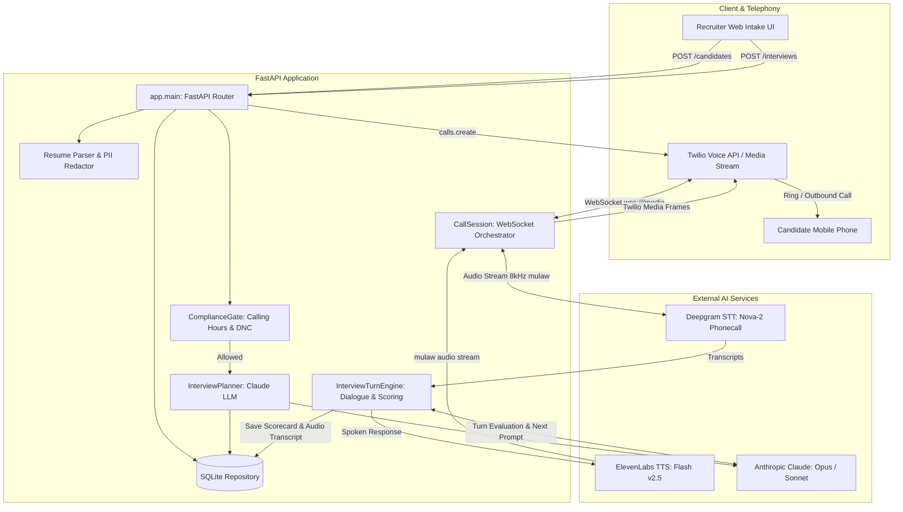

# Architecture & Step-by-Step Build Guide: AI Candidate Voice Interviewer

An end-to-end architecture specification and engineering guide for building a consent-first, résumé-led outbound voice interview system.

---

## 1. System Overview

The **AI Candidate Interviewer** automates first-round screening phone calls. Rather than asking generic interview questions, it analyzes an uploaded candidate résumé and a target job rubric, generates a tailored 4-to-6 question interview plan, dials the candidate via standard telephony, and conducts a conversational interview in real-time.

```
+-----------------------------------------------------------------------------------+
|                                 HIGH LEVEL FLOW                                   |
|                                                                                   |
|  [ Recruiter UI ]                                                                 |
|        │ Upload Résumé + Phone                                                    |
|        ▼                                                                          |
|  [ FastAPI Intake API ] ──► [ Text Extraction & PII Redaction ]                   |
|        │                               │                                          |
|        │                               ▼                                          |
|        ▼                        [ Claude LLM ] ──► [ 4-6 Question Plan ]          |
|  [ Twilio Outbound Call ]                                  │                      |
|        │                                                   │                      |
|        ▼ (WebSocket wss://.../media)                       ▼                      |
|  [ Voice Engine ] ◄─────────────────────────────── [ Question Rubric ]            |
|    ├── STT: Deepgram (Nova-2 8kHz mulaw)                                          |
|    ├── Turn Engine: Claude (Structured JSON assessment per turn)                  |
|    └── TTS: ElevenLabs (Flash v2.5 8kHz streaming)                               |
|        │                                                                          |
|        ▼                                                                          |
|  [ Scorecard & Recommendation ] (0-100% Weighted Score + Evidence Quotes)         |
+-----------------------------------------------------------------------------------+
```

### Core Design Principles
1. **Consent-First**: The AI explicitly discloses it is an automated assistant and requires spoken consent before recording or evaluating answers.
2. **Candidate-Grounded**: Questions directly probe verifiable achievements and projects extracted from the candidate's résumé.
3. **Sub-Second Telephony Latency**: Low-latency streaming protocols (Twilio media stream + Deepgram WebSocket + ElevenLabs chunked streaming + Barge-in support).
4. **Explainable Rubric**: Outputs weighted 0–4 scores with direct quotes ("evidence") and justifications ("rationale") to aid human recruiters rather than auto-rejecting.

---

## 2. Technical Architecture

### Component Breakdown



---

## 3. Real-Time Voice Protocol & Audio Pipeline

Twilio connects phone audio to the server using bidirectional WebSockets over the standard G.711 mu-law (8000 Hz, 1 channel) format:

### Audio Flow Specifications

| Stage | Service / Protocol | Format / Specs | Target Latency |
| :--- | :--- | :--- | :--- |
| **Inbound Audio** | Twilio Media Stream | 8kHz mulaw, 20ms chunks (160 bytes) | $< 50\text{ ms}$ |
| **Live Transcription** | Deepgram `nova-2-phonecall` | WebSocket streaming, `endpointing=300ms` | $\sim 250\text{ ms}$ |
| **Turn Reasoner** | Anthropic Claude | JSON Schema structured outputs | $\sim 600\text{ ms}$ |
| **Speech Generation** | ElevenLabs `eleven_flash_v2_5` | Streaming HTTP, `ulaw_8000`, 320-byte chunks | $\sim 200\text{ ms}$ to first byte |
| **Barge-in (Interrupt)** | Local Voice Activity Detection | Deepgram interim results cancel active TTS | $< 150\text{ ms}$ |

---

## 4. Step-by-Step Build Guide

Follow this phased approach to construct this application from scratch.

---

### Phase 1: Environment & Project Foundation

#### 1.1 Project Structure
```text
interview/
├── backend/
│   ├── app/
│   │   ├── compliance/
│   │   │   ├── __init__.py
│   │   │   └── tcpa.py            # Calling-hours check and DNC list
│   │   ├── interview/
│   │   │   ├── __init__.py
│   │   │   ├── models.py          # Data classes for plans, questions, and scores
│   │   │   ├── planner.py         # LLM-based tailored question generator
│   │   │   ├── prompts.py         # Prompt templates and turn schemas
│   │   │   ├── repository.py      # SQLite database persistence layer
│   │   │   ├── resume.py          # PDF/DOCX extraction and PII redaction
│   │   │   └── turn_engine.py     # Live evaluation engine per turn
│   │   ├── voice/
│   │   │   ├── __init__.py
│   │   │   ├── session.py         # Twilio WebSocket call orchestrator
│   │   │   ├── stt.py             # Deepgram streaming client
│   │   │   └── tts.py             # ElevenLabs streaming client
│   │   ├── web/
│   │   │   └── index.html         # Candidate intake UI
│   │   ├── __init__.py
│   │   ├── config.py              # Configuration and environment settings
│   │   └── main.py                # FastAPI HTTP routes and WebSocket entry point
│   ├── data/                      # Local SQLite database & uploaded resumes
│   ├── tests/                     # Unit and integration tests
│   ├── .env.example
│   └── requirements.txt
```

#### 1.2 Dependencies (`requirements.txt`)
```text
anthropic>=0.75
fastapi>=0.115
uvicorn[standard]>=0.32
websockets>=13.0
httpx>=0.27
twilio>=9.3
python-multipart>=0.0.18
pypdf>=5.0
```

---

### Phase 2: Configuration & SQLite Persistence

#### 2.1 Configuration (`app/config.py`)
Define application settings using Python `dataclasses`:
- Credentials: `ANTHROPIC_API_KEY`, `DEEPGRAM_API_KEY`, `ELEVENLABS_API_KEY`, `TWILIO_ACCOUNT_SID`, `TWILIO_AUTH_TOKEN`, `TWILIO_FROM_NUMBER`.
- Dynamic Settings: `PUBLIC_HOST` (ngrok domain), `DATA_DIR` (data storage folder), `ANTHROPIC_MODEL`.

#### 2.2 Data Models & Schemas (`app/interview/models.py`)
Create dataclasses for:
- `Question`: `question_id`, `prompt`, `competency`, `rationale`, `weight` (0.5 to 2.0).
- `InterviewPlan`: `job_title`, list of `Question`, `scoring_guidance`.
- `AnswerAssessment`: `score` (0 to 4), `evidence` (quote from candidate), `rationale`.
- `InterviewProfile`: Tracks dialogue state, consent status, full transcript, overall score calculation, and final recommendation.

#### 2.3 SQLite Storage (`app/interview/repository.py`)
Create two main relational tables:
1. `candidates`:
   - `id`, `full_name`, `phone`, `email`, `job_title`, `role_rubric`, `timezone`, `contact_consent`, `resume_path`, `created_at`.
2. `interviews`:
   - `id`, `candidate_id`, `status` (`planned`, `in_progress`, `completed`), `call_sid`, `plan_json`, `result_json`, `created_at`, `completed_at`.

---

### Phase 3: Résumé Processing & Privacy-Safe Redaction

#### 3.1 Text Extraction (`app/interview/resume.py`)
- Read PDF bytes using `pypdf.PdfReader` and extract raw text line-by-line.
- Validate maximum upload file size (e.g., 5 MB limit) and file extension (`.pdf`, `.docx`, `.txt`).

#### 3.2 PII Redaction
- Scrub emails, physical addresses, phone numbers, and demographics before passing text to the LLM.
- **Why**: Prevents unintentional bias in question planning and minimizes exposure of private candidate data to third-party APIs.

---

### Phase 4: Tailored Question Planning

#### 4.1 Schema-Driven Generation (`app/interview/planner.py`)
Submit the candidate's redacted résumé and job rubric to Claude using JSON Schema validation:
```json
{
  "questions": [
    {
      "question_id": "resume_project",
      "prompt": "Your résumé mentions building a microservices platform. What was your personal contribution and the outcome?",
      "competency": "system design & ownership",
      "rationale": "Validates actual hands-on claims made in the résumé",
      "weight": 1.5
    }
  ],
  "scoring_guidance": "Score based on depth, correctness, and ownership."
}
```

#### 4.2 Deterministic Fallback
If the LLM call fails (e.g., rate limits or zero credits), trigger a regex fallback:
- Search the résumé for action verbs (`built`, `led`, `designed`, `developed`, `improved`).
- Construct a standardized 5-question interview plan that extracts that achievement, ensuring calls are never blocked.

---

### Phase 5: Telephony & Streaming Voice Pipeline

#### 5.1 Twilio WebSocket Bridge (`app/voice/session.py`)
- Handle the `/media` WebSocket route.
- On connection, parse Twilio's `"start"` event to retrieve `streamSid` and `interview_id`.
- Maintain two concurrent asynchronous loops:
  1. **Inbound Pump**: Read audio packets from Twilio and pipe them to Deepgram STT.
  2. **Transcript Consumer**: Receive finalized transcripts from Deepgram, feed them into the Turn Engine, and stream TTS audio back to Twilio.

#### 5.2 Streaming STT (`app/voice/stt.py`)
- Connect to `wss://api.deepgram.com/v1/listen` with:
  - `encoding=mulaw`, `sample_rate=8000`, `model=nova-2-phonecall`
  - `interim_results=true`, `endpointing=300ms`, `punctuate=true`
- **Interim results** trigger Barge-in: if the candidate starts speaking while the AI is talking, cancel the active TTS task and clear Twilio's audio buffer immediately.
- **Finalized transcripts** trigger the next conversational turn.

#### 5.3 Streaming TTS (`app/voice/tts.py`)
- Stream synthesized speech from ElevenLabs via `https://api.elevenlabs.io/v1/text-to-speech/{voice_id}/stream?output_format=ulaw_8000`.
- Use low-latency models (`eleven_flash_v2_5`) yielding chunks in 320-byte frames (40ms each).
- Base64-encode and wrap each chunk in a Twilio `"media"` JSON frame:
  ```json
  {"event": "media", "streamSid": "...", "media": {"payload": "<base64>"}}
  ```

---

### Phase 6: Turn Engine & Human-Review Scorecard

#### 6.1 Conversational Turn Loop (`app/interview/turn_engine.py`)
At each turn:
1. Verify verbal consent (`"Yes, I agree"`). If consent is refused, thank the candidate and terminate the call immediately.
2. If consent is active, prompt the candidate with the next planned question.
3. Score previous answers on a `0–4` scale:
   - **4 (Strong Evidence)**: Directly addresses the prompt with specific metrics, depth, and verified ownership.
   - **2–3 (Moderate Evidence)**: Sound theoretical understanding, moderate personal contribution.
   - **0–1 (Insufficient Evidence)**: Vague, incorrect, or evasive answer.

#### 6.2 Overall Score & Recommendation Calculation
In [app/interview/models.py](file:///Users/pradeep/Documents/ChatGPT/interview/backend/app/interview/models.py):

$$\text{Overall Score (\%)} = \frac{\sum (\text{Score}_i \times \text{Weight}_i)}{4 \times \sum \text{Weight}_i} \times 100$$

- **Score $\ge 70\%$**: `recommend_human_shortlist_review`
- **Score $< 70\%$**: `recommend_human_review_before_rejecting`
- **Incomplete Call**: `more_evidence_needed`

---

### Phase 7: Recruiter Web Interface & API

#### 7.1 Web Interface (`app/web/index.html`)
- Built in clean vanilla HTML/CSS/JS (no framework overhead).
- Provides fields for Candidate Name, Mobile Number (E.164), Role Title, Timezone, Evaluation Rubric, and Résumé upload.
- Displays the generated question plan and live interview status.

#### 7.2 API Endpoints (`app/main.py`)
- `POST /candidates`: Upload résumé and store candidate profile.
- `POST /candidates/{id}/interviews`: Generate question plan and place outbound Twilio call.
- `GET /interviews/{id}`: Fetch interview transcript, per-question evidence, score, and recommendation.
- `GET /health`: Inspect configuration status and missing environment credentials.

---

## 5. Production Readiness & Compliance Checklist

| Area | Requirement | Implementation Strategy |
| :--- | :--- | :--- |
| **TCPA / Calling Hours** | Restrict calls to reasonable daylight hours | Candidate timezone validation; block outside 09:00–20:00 local time |
| **Do-Not-Call (DNC)** | Immediate opt-out compliance | If candidate says *"stop"* or *"do not call"*, suppress phone in repository |
| **Audio Privacy** | Consent gate | Disclose AI identity; discard audio/transcripts if consent is denied |
| **Network Tunnels** | Public webhook endpoint | Use ngrok for development; use static HTTPS/WSS domain with TLS in production |
| **Security** | Secrets management | Store API keys in environment variables or cloud secret managers (never commit `.env`) |

---

## 6. How to Verify Your Build

Run the test suite to validate all core subsystems without consuming API credits:
```bash
cd backend
python -m unittest discover -s tests -v
```

Tests cover:
- `test_resume.py`: PDF text extraction and PII redaction.
- `test_compliance.py`: Calling hours and DNC suppression.
- `test_profile.py`: Weighted score and recommendation calculation.
- `test_intake_api.py`: FastAPI endpoints and payload boundaries.
